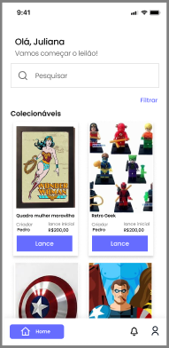

# Projeto de Interface

Pré-requisitos: <a href="2-Especificação do Projeto.md"> Documentação de Especificação</a>

Visão geral da interação do usuário pelas telas do sistema e protótipo interativo das telas com as funcionalidades que fazem parte do sistema (wireframes).

 Apresente as principais interfaces da plataforma. Discuta como ela foi elaborada de forma a atender os requisitos funcionais, não funcionais e histórias de usuário abordados nas <a href="2-Especificação do Projeto.md"> Documentação de Especificação</a>.

## Diagrama de Fluxo

O diagrama apresenta o estudo do fluxo de interação do usuário com o sistema interativo e  muitas vezes sem a necessidade do desenho do design das telas da interface. Isso permite que o design das interações seja bem planejado e gere impacto na qualidade no design do wireframe interativo que será desenvolvido logo em seguida.

## Wireframe Interativo

Conforme o diagrama de fluxo do projeto apresentado anteriormente, as telas do sistema são detalhadas nos itens subsequentes. 

Para acessar o wireframe interativo, acesse o ambiente https://www.figma.com/file/tvTmw6ooRbQybDahix2925/Geek-bid?type=design&node-id=0-1&mode=design&t=UTHXdQbq9iEme6Qg-0  disponível pela plataforma Figma.
 
As telas do sistema seguem uma estrutura padrão, conforme ilustrado na Figura abaixo. Nessa estrutura, identificamos dois principais blocos, os quais estão detalhados a seguir:

Conteúdo: exibe o conteúdo da tela em questão;
Barra de navegação: mostra os elementos de navegação disponíveis, que estão associados aos elementos do bloco de conteúdo.

- Tela inicial: 

A tela de navegação inicial foi projetada para proporcionar uma transição intuitiva entre as opções de login e registro. Ela apresenta os seguintes elementos:

Botão "Login": Ao clicar neste botão, os usuários são direcionados para a tela de login, onde podem inserir suas credenciais para acessar o sistema.

Botão "Registro": Esta opção permite que novos usuários criem uma conta no sistema. Ao clicar neste botão, os usuários são encaminhados para a tela de cadastro, onde podem preencher as informações necessárias para criar uma nova conta.

- Tela cadastro:

A tela de cadastro foi meticulosamente projetada para facilitar o processo de entrada de novos usuários no sistema. Ela é composta pelos seguintes campos e elementos:

Campo Nome:

Este campo destina-se à inserção do nome do usuário, permitindo que seja fornecido de maneira clara e concisa.
Campo Sobrenome:

Aqui, os usuários podem inserir seu sobrenome, fornecendo informações adicionais para personalizar a conta.
Campo E-mail:

O campo de e-mail é projetado para receber o endereço de e-mail exclusivo do usuário, que será usado como identificação única no sistema.
Campo Senha:

Os usuários são incentivados a criar uma senha segura e confidencial neste campo, garantindo a proteção adequada de sua conta.
Campo Confirmar Senha:

Para garantir precisão, este campo solicita que os usuários confirmem a senha digitada anteriormente, minimizando erros de digitação.
Botão "Cadastrar":

Ao clicar neste botão, o sistema valida os dados inseridos nos campos e, se todas as informações estiverem corretas, registra o novo usuário no sistema.

- Tela login:

A tela de login foi projetada para garantir um acesso seguro e eficiente ao sistema. Ela é composta pelos seguintes elementos:

Campo de E-mail:

Neste campo, os usuários devem inserir o endereço de e-mail associado à sua conta para autenticação.
Campo de Senha:

Este campo permite que os usuários insiram sua senha confidencial para acessar a conta.
Botão "Login":

Ao clicar neste botão, o sistema verifica as credenciais inseridas. Se as informações de login estiverem corretas, os usuários serão direcionados para a página inicial ("Home") do sistema.

- Tela Home:
  
A tela inicial do aplicativo de leilão foi projetada para oferecer uma visão abrangente e acessível dos leilões em andamento, trazendo as principais  funcionalidades do app aos usuários:

Lista de Itens em Leilão:

Exibe uma lista visual de itens disponíveis para leilão, acompanhados por uma imagem representativa e uma breve descrição. Os usuários podem explorar facilmente os itens disponíveis para lances.

Botão "Lance" para Cada Item:

Localizado abaixo de cada item em leilão, o botão "Lance" permite aos usuários participar dos leilões em tempo real, direcionando-os a tela de lance.

Campo de Pesquisa:

Oferece aos usuários a capacidade de realizar pesquisas específicas por itens. Eles podem inserir palavras-chave ou detalhes específicos para localizar os itens desejados.

Campo de Filtro:

Permite que os usuários filtrem os itens com base em opções disponíveis, 

Barra de Navegação Inferior:

Apresenta uma barra de navegação na parte inferior da tela, composta por ícones representando o perfil do usuário, notificações e  botão "Home". 
O ícone de perfil permite acesso rápido às configurações da conta, 
enquanto o ícone de notificação alerta sobre eventos importantes. 
O botão "Home" direciona os usuários de volta à tela inicial a qualquer momento.

- Tela Lance:

A tela de lance foi projetada para proporcionar aos usuários uma experiência fácil e interativa ao participar de leilões. Nesta tela, os seguintes elementos estão presentes:

Informações do Item em Leilão:

Exibe detalhes específicos do item selecionado para o lance, incluindo uma imagem representativa e uma breve descrição. Essas informações ajudam os usuários a tomar decisões informadas antes de efetuar seus lances.

Campo de Valor do Lance:

Um campo claro e destacado permite que os usuários insiram o valor desejado para o lance. 

Botão "Envie seu Lance":

Ao clicar neste botão, o sistema valida o valor inserido no campo de lance. Se o valor for válido e atender aos requisitos do leilão, o lance é enviado com sucesso

- Tela Confira seu Lance:

A tela "Confira Seu Lance" foi desenvolvida para fornecer aos usuários uma visão detalhada e a oportunidade de revisar as informações antes de confirmar o envio do lance. Esta tela inclui os seguintes elementos:

Detalhes do Lance:

Apresenta informações detalhadas sobre o lance, incluindo o item em leilão, a descrição, e o valor do lance fornecido pelo usuário. Esta seção permite aos usuários revisar todas as informações antes de prosseguir.

Botão "Enviar Lance":

Ao clicar neste botão, o sistema processa e registra o lance enviado. 

Botão "Cancelar":

Este botão oferece aos usuários a opção de cancelar o envio do lance. Ao clicar em "Cancelar", uma confirmação adicional é solicitada para evitar cancelamentos acidentais. Ao cancelar o envio do lance, o usuário é redirecionado de volta à tela de lance original.

Mensagem de Sucesso:

Após o envio bem-sucedido do lance, uma mensagem de sucesso é exibida, informando ao usuário que o lance foi registrado com êxito. Essa confirmação reforça a participação bem-sucedida no leilão.

- Tela Cadastro de leilão:

A tela de cadastro de leilão foi projetada para permitir aos usuários cadastrar novo leilão no aplicativo. Nesta tela, são fornecidas as seguintes funcionalidades:

Upload de Imagem do Item:

Permite aos usuários fazer o upload de uma imagem representativa do item que desejam leiloar. 

Campo Nome:

Permite que os usuários forneçam um nome descritivo para o item a ser leiloado, facilitando a identificação.

Campo Descrição:

Oferece um espaço para os usuários inserirem uma descrição detalhada do item, 

Campo Categoria:

Permite a seleção da categoria à qual o item pertence, facilitando a organização e busca eficiente.

Campo Lance Mínimo:

Permite que os usuários definam o valor mínimo de lance aceitável para o item leiloado, assegurando um valor inicial adequado.

Campo Duração:

Permite a definição do período de tempo durante o qual o leilão estará ativo. Os usuários podem configurar a duração desejada para o leilão.

Botão "Salvar Alterações":

Ao clicar neste botão, as informações inseridas são salvas como rascunho. Isso permite que os usuários editem e finalizem os detalhes do leilão posteriormente.

Botão "Publicar":

Ao clicar neste botão, o leilão é publicado e torna-se visível para outros usuários. Isso inicia o período de lance para o item.

Botão "Excluir":

Permite aos usuários excluir o leilão caso decidam não prosseguir com a publicação.

- Tela Perfil:
  
A tela de perfil foi desenvolvida para oferecer aos usuários acesso rápido e às informações e funcionalidades relacionadas à sua conta. Nesta tela, são fornecidas as seguintes opções:

Minhas Informações:

Permite aos usuários visualizar e editar suas informações cadastrais, Também oferece a opção de excluir a conta, com uma confirmação para evitar exclusões acidentais.

Meus Leilões:

Apresenta uma lista dos leilões cadastrados pelo usuário. Essa seção fornece uma visão consolidada dos itens que o usuário está leiloando, permitindo edições, exclusões ou acompanhamento do status dos leilões.

Meus Lances:

Permite ao usuário visualizar os itens nos quais realizou lances. Essa seção oferece uma visão organizada e acessível dos lances feitos, facilitando o acompanhamento e a gestão da participação em leilões.

Novo Leilão:

Oferece aos usuários a capacidade de cadastrar um novo leilão. Ao clicar nesta opção, eles são direcionados para a tela de cadastro de leilão, onde podem inserir os detalhes do item, configurar o lance mínimo e a duração do leilão.

Logout do Sistema:

Ao clicar nesta opção, o usuário é desconectado e retorna à tela de login.

- Tela notificações:
  
Ao clicar no ícone de notificações na barra de navegação, os usuários têm acesso a uma tela dedicada às notificações, onde são apresentadas informações importantes relacionadas às suas atividades no sistema. As notificações incluem:

Notificação: Você Recebeu um Lance:

Informa ao usuário que recebeu um lance em um dos itens que está leiloando. Essa notificação fornece detalhes sobre o item específico e o valor do lance recebido.

Notificação: Você Arrematou! 

Notifica o usuário quando ele venceu um leilão. A mensagem informa sobre o sucesso no arremate e fornece detalhes sobre o item leiloado, incluindo o valor final do lance.

Notificação: Leilão Próximo do Fim:

Alerta o usuário quando um leilão que ele está acompanhando ou no qual participou está próximo do fim. Essa notificação serve como um lembrete para que o usuário possa considerar fazer lances finais, se desejado.

- Tela arremate:

A tela de arremate é exibida quando um usuário vence um leilão e fornece informações sobre a conclusão bem-sucedida da aquisição. A tela inclui:

Mensagem de Parabéns:

Uma mensagem calorosa parabenizando o usuário pelo arremate bem-sucedido. Esta mensagem destaca a vitória no leilão e a conquista do item desejado.

Botão "Pagar Agora":

Ao clicar neste botão, o usuário é direcionado para as instruções de pagamento. Instruções de Pagamento:

- Tela detalhes do Leilão:

Exibe informações completas sobre o leilão, incluindo o nome do item, descrição, categoria.

Últimos Lances Dados:

Fornece uma lista dos últimos lances dados no leilão, exibindo os valores dos lances, os usuários que deram os lances mais recentes. Essa seção oferece ao vendedor uma visão instantânea da atividade recente no leilão.

Botão voltar

 Ao clicar nesse botão, o vendedor é redirecionado para a tela meus leilões.
 

- Tela Editar Leilão:

A tela de editar leilão proporciona ao vendedor a oportunidade de ajustar as informações de um leilão antes de publicá-lo ou durante a fase de edição. Esta tela inclui:

Detalhes do Item para Edição:

Exibe os detalhes do leilão, incluindo imagem, nome, descrição, categoria, lance mínimo, duração, e outros detalhes relevantes. Todos esses campos estão prontos para edição.
Campo para Upload de Nova Imagem:

Permite ao vendedor fazer upload de uma nova imagem para representar o item em leilão, caso deseje realizar alterações visuais.

Botão "Salvar Alterações":
Ao clicar neste botão, as informações editadas são salvas, mas o leilão não é publicado imediatamente. Isso permite ao vendedor realizar edições sem tornar as alterações imediatamente visíveis aos participantes do leilão.

Botão "Publicar":
Ao clicar neste botão, as informações editadas são salvas e o leilão é publicado. Isso torna as alterações visíveis aos participantes do leilão. Se o leilão não foi publicado anteriormente, este botão realiza a publicação inicial.

 

 
> **Links Úteis**:
> - [Protótipos vs Wireframes](https://www.nngroup.com/videos/prototypes-vs-wireframes-ux-projects/)
> - [Ferramentas de Wireframes](https://rockcontent.com/blog/wireframes/)
> - [MarvelApp](https://marvelapp.com/developers/documentation/tutorials/)
> - [Figma](https://www.figma.com/)
> - [Adobe XD](https://www.adobe.com/br/products/xd.html#scroll)
> - [Axure](https://www.axure.com/edu) (Licença Educacional)
> - [InvisionApp](https://www.invisionapp.com/) (Licença Educacional)
