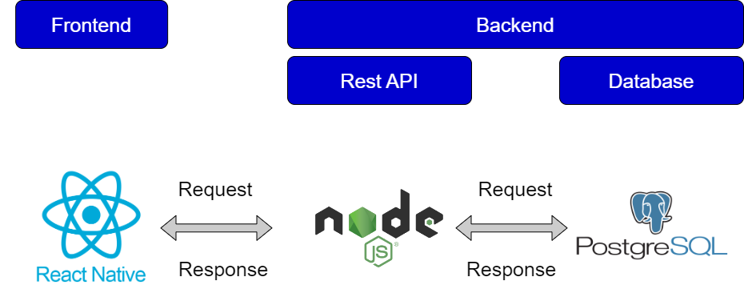
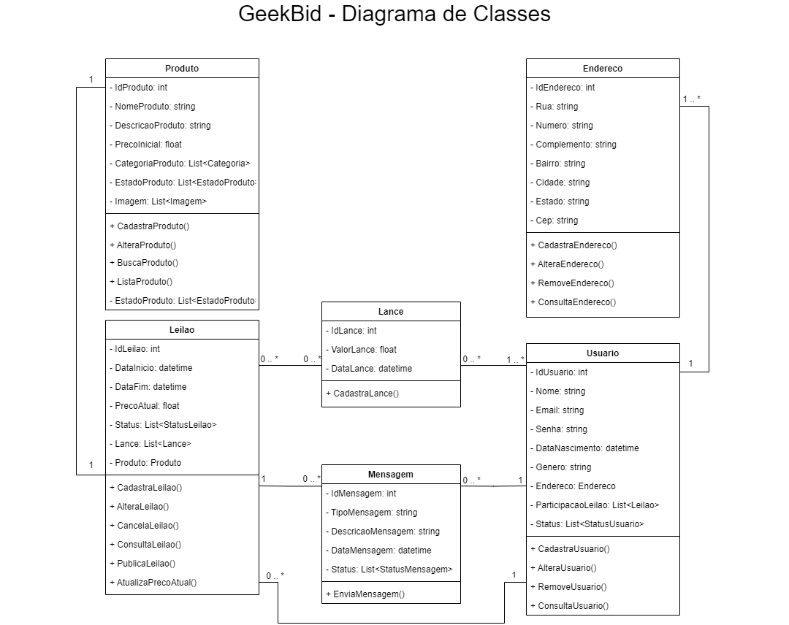
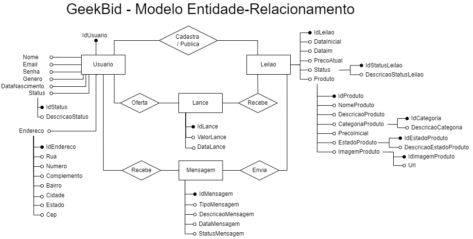
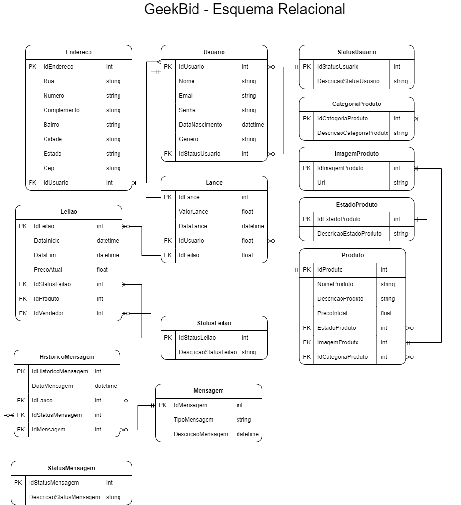

# Arquitetura da Solução

Pré-requisitos: <a href="4-Projeto de Interface.md"> Projeto de Interface</a>

Definição de como o software é estruturado em termos dos componentes que fazem parte da solução e do ambiente de hospedagem da aplicação.

## Diagrama de Classes

O diagrama de classes ilustra graficamente como será a estrutura do software, e como cada uma das classes da sua estrutura estarão interligadas. Essas classes servem de modelo para materializar os objetos que executarão na memória.

## Modelo Entidade-Relacionamento

O Modelo Entidade-Relacionamento representa através de um diagrama como as entidades (coisas, objetos) se relacionam entre si na aplicação interativa.

## Esquema Relacional

## Modelo Físico

Arquivo disponível em [banco.sql](/src/bd/banco.sql).

## Tecnologias Utilizadas

Arquitetura de componentes e ambiente de hospedagem:

**Aplicativo Móvel:**

O aplicativo móvel será desenvolvido na linguagem JavaScript, utilizando React Native pela facilidade de gerar elementos de inferface tanto para usuários de iOS quanto de Android.

**Repositório:**

Utilizamos o GitHub como repositório, armazenando o código, arquivos e  histórico de revisão do projeto facilitando assim o acesso e colaboração dos integrantes.

**Gestão de Projeto:**

Foi feita atravás do Github Projects nele planejamos, distribuimos as tarefas e acompanhamos cada etapa da construção do projeto.

**IDEs:**

Como ambiente de desenvolvimento e teste utilizamos o tradicional Visual Studio Code e também o Expo, uma plataforma open-souce utilizada no desenvolvimento mobile com React Native que permite o fácil acesso às API’s nativas do dispositivo.

**Backend:**

Para desenvolvimento do backend, será utilizado o Node.js, ele será o cérebro do sistema, gerenciando toda a lógica de negócios, processamento de dados, gerenciamento de usuários e comunicação com o banco de dados.

**Banco de Dados:**

O sistema de banco de dados escolhido foi o PostgreSQL, um banco de dados relacional para garantir a integridade e consistência dos dados. Ele será responsável por armazenar todos os dados relacionados aos usuários, produtos, leilões, pedidos e outras informações essenciais da aplicação.

**Prototipagem:**

O protótipo da aplicação foi feito utilizando o Figma, uma plataforma colaborativa para construção de design de interfaces e protótipos.

**Fluxogramas:**

- Lucidchart: Uma ferramenta de colaboração visual ajuda a criar mapas e fluxogramas para visualizar qualquer processo.
- Miro: Plataforma de colaboração digital projetada para facilitar a comunicação remota e distribuída de equipes e o gerenciamento de projetos.

**Comunicação:**
A equipe realiza reuniôes semanais com o orientador através do Teams, bem como reuniôes periódicas no Discord para discutir, dividir tarefas e acompanhar a evolução do projeto. Conversas pontuais e decisões rápidas no dia a dia são feitas através do Whatsapp.

**Serviços de Terceiros:**

O sistema pode integrar serviços de terceiros para funcionalidades adicionais, como sistemas de pagamento (ex: PayPal, Stripe), serviços de autenticação (ex: Auth0, Firebase Authentication), e serviços de envio e logística (ex: Correios, FedEx).

## Hospedagem

O aplicativo e seus componentes serão hospedados em uma infraestrutura de nuvem no Microsoft Azure, para garantir escalabilidade, disponibilidade, segurança e gerenciamento da aplicação de forma simplificada.
Essa estrutura permite uma arquitetura escalável, modular e robusta para o aplicativo de leilão online, garantindo uma experiência confiável e satisfatória para os usuários, além de facilitar a manutenção e evolução contínua do sistema. 

## Qualidade de Software

| Característica          | Requisito                                                                                                                                                            | Métricas                                                                                                                                                                                      |
| ----------------------- | -------------------------------------------------------------------------------------------------------------------------------------------------------------------- | --------------------------------------------------------------------------------------------------------------------------------------------------------------------------------------------- |
| Funcionalidade          | O sistema deve permitir que os usuários se cadastrem, façam login, participem de leilões, realizem lances, realizem pedidos e gerenciem suas contas de forma eficaz. | Taxa de sucesso do cadastro e login.   Número de lances feitos por leilão.   Taxa de sucesso dos pedidos realizados.                                                                    |
| Confiabilidade          | O sistema deve ser robusto e confiável, minimizando falhas e garantindo a disponibilidade do serviço.                                                                | Tempo médio entre falhas (MTBF).   Tempo médio de recuperação (MTTR).   Taxa de disponibilidade do sistema.                                                                             |
| Usabilidade             | O sistema deve ser fácil de usar, com uma interface intuitiva e amigável para os usuários.                                                                           | Taxa de conclusão de tarefas.   Tempo médio de aprendizado para realizar tarefas comuns.   Nível de satisfação do usuário através de pesquisas de satisfação.                           |
| Eficiência e Desempenho | O sistema deve responder rapidamente e ser eficiente em termos de uso de recursos.                                                                                   | Tempo de resposta das principais operações do sistema (cadastro, login, lances).   Utilização média da CPU e memória. Número máximo de usuários suportados simultaneamente.                |
| Manutenibilidade        | O sistema deve ser facilmente mantido e evoluído, com código bem estruturado e documentação adequada.                                                                | Taxa de correção de defeitos.   Tempo médio para implementar uma nova funcionalidade.   Cobertura de código por testes automatizados.                                                   |
| Portabilidade           | O sistema deve ser compatível com diferentes dispositivos e plataformas.                                                                                             | Número de plataformas suportadas (web, iOS, Android).   Tempo médio para adaptação do sistema a uma nova plataforma.   Facilidade de instalação e configuração em diferentes ambientes. |
